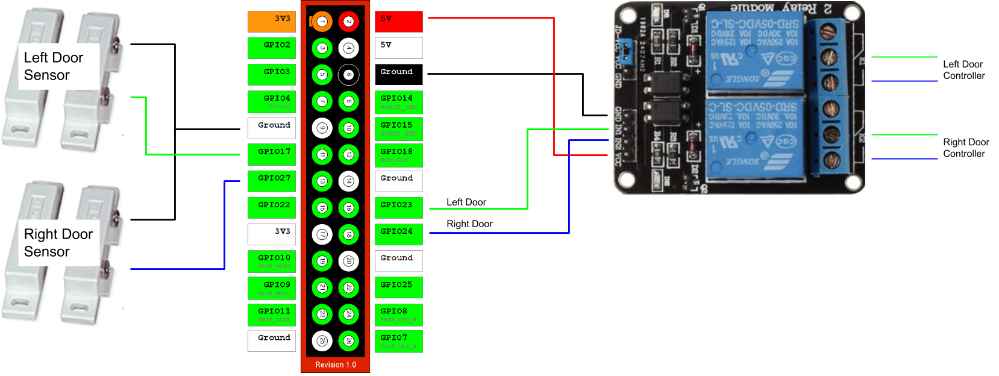

## What is GarageQTPi

GarageQTPi is an implementation that provides methods to communicate with a Raspberry Pi garage door opener via the MQTT protocol.
Although it is designed to work out of the box with a Home Assistant cover component it can also be used as the basis for any Raspberry Pi garage project.

## Motivation

Home Assistant has integration for raspberry pi garage door openers but only if the instance of Home Assistant is running on the raspberry pi. If your raspberry pi is soley a garage door opener like mine
then you need to use an MQTT cover component to interface with the pi.

## Hardware

1. Raspberry pi 3
   * [Canakit with everything ~$75](https://www.amazon.com/CanaKit-Raspberry-Complete-Starter-Kit/dp/B01C6Q2GSY)
   * [Canakit with PS/case ~$50](https://www.amazon.com/CanaKit-Raspberry-Clear-Power-Supply/dp/B01C6EQNNK)
2. Relay
   * [Sainsmart 2-channel](https://www.amazon.com/gp/product/B0057OC6D8)
3. Magnetic switches
   * [Magnetic Switches](https://www.amazon.com/gp/product/B0009SUF08)
4. Additional wires/wire nuts. 
    * 14 gauge solid copper wire for garage motor wiring
    * 20-22 gauge copper wire for magnetic switch wiring
    * jumper wiries for GPIO pins
5. Mounting Hardware. 
    * See installation section for mounting ideas.

Total cost: ~75-$100. Cheaper if you already have some raspberry pi parts

## Wiring/Installation



Copyright (c) 2013 andrewshilliday

Note: The switches I linked have 3 terminals (COM, NO, NC). You should wire up COM to GND and NO to the GPIO.

**Important: The above diagram is outdated, pin 21 may actually be pin 27. Consult your raspberry pi's pin diagram**

### Relay wiring
**IMPORTANT: You shoud always consult with a manual before wiring**

It's impossible to write a generic guide as all garage door motors are not equal. I will instead explain what I did as a reference that you can use. 

The basic idea is to wire it in parallel with the button on the wall.
The code is essentially mimicking a button press by switching the relay on and off quickly. In my case the two leftmost wires (red/white) are connected to the button on the wall.
The two rightmost white wires are for the collision detection sensors. So I removed the two leftmost wires, wirenutted 3 solid 14 gauge wires together (the button wire, my relay wire, and then one wire to go to the garage door opener) two times for each of the two wires.


### Magnetic switch wiring
I ran the magnetic switch wires along the same path as the sensor wires, stapled them to the wall, and stuck the magnetic switches to the door and wall as close as I could get them. As noted above wire up the COM (common) to the GND pin and the NO (normally open) to the GPIO pin.


Notice mine aren't exactly on the same plane but I was monitoring the gpio pins in the code to make sure they were close enough to complete the circuit before I attached them. So far the included 3M sticky tape is holding up but time will tell.
### Mounting
I've seen a lot of people mounting the pi/relay onto plywood and mounting that to the ceiling. I wasn't really keen on that so what I did was drill four small holes into the top of my pi and found screws and nylon spacers at lowes. I attached the
relay to the top of the pi case. 


The pi case included with the Canakit has mounting holes on the back, so I used small bolts that sit flush into the mounting holes, and then large washers and attached the case to the garage door mount. 
The lid to the case comes off easily so once it was mounted I ran zip ties around the lid and secured it. I also squirted locktite around all the screw threads to keep the vibration of the garage door from shaking any screws loose.
So far this has proved to be relatively stable.


## Software

### Prereqs 
* Raspberry pi 3 running rasbian jessie
* Python 2.7.x
* pip (python 2 pip)

### Installation
1. `git clone https://github.com/Jerrkawz/GarageQTPi.git`
2. `pip install -r requirements.txt`
3. edit the configuration.yaml to set up mqtt (See below)
4. `python main.py` 
5. To start the server on boot run `sudo bash autostart_systemd.sh`

## MQTT setup
I won't try to butcher an mqtt setup guide but will instead link you to some other resources:

HomeAssistant MQTT Setup: https://home-assistant.io/components/mqtt/

Bruh Automation: https://www.youtube.com/watch?v=AsDHEDbyLfg

## Home Assistant component setup
Either follow the cover setup or enable mqtt discovery  
HomeAssistant MQTT Cover: https://home-assistant.io/components/cover.mqtt/  
HomeAssistant MQTT Discovery: https://home-assistant.io/docs/mqtt/discovery/

Screenshot:

![Home assistant ui][1]

## API Reference

The server works with the Home Assisant MQTT Cover component out of the box but if you want to write your own MQTT client you need to adhere to the following API:

Publish one of the following UPPER CASE strings to the command_topic in your config:

`OPEN | CLOSE | STOP`

Subscribe to the state_topic in your config and you will recieve one of these lower case strings when the state pin changes:

`open | closed`

Thats it!

## Sample Configuration

config.yaml:
```
mqtt:
    host: m10.cloudmqtt.com
    port: *
    user: *
    password: *
doors:
    -
        id: 'left'
        relay: 23
        state: 17
        state_topic: "home-assistant/cover/left"
        command_topic: "home-assistant/cover/left/set"
    -
        id: 'right'
        relay: 24
        state: 27
        state_topic: "home-assistant/cover/right"
        command_topic: "home-assistant/cover/right/set"
```

### Optional configuration
There are five optional configuration parameters.  
Two of the option parameters are for mqtt.  One is to enable discovery by HomeAssistant. The second one changes the discovery prefix for HomeAssitant.
```
mqtt:
    host: m10.cloudmqtt.com
    port: *
    user: *
    password: *
    discovery: true
    discovery_prefix: 'homeassistant'
```

The discovery parameter defaults to false and should be set to true to enable discovery by HomeAssistant. If set to true, the door state_topic and command_topic parameters are not necessary and are ignored.  
The discovery_prefix parameter defaults to 'homeassistant' and shouldn't be changed unless changed in HomeAssistant

The other three of the option parameters are for the doors. One to give the door a name for discovery.  The second one to flip the state pin of the magnetic switch in the invent of a different wiring schema. The third one to filp the relay logic.  This is a per door configuration option like:
```
doors:
    -
        id: 'left'
        name: 'Left Garage Door'
        relay: 23
        state: 17
        state_mode: normally_closed
        invert_relay: true
        state_topic: "home-assistant/cover/left"
        command_topic: "home-assistant/cover/left/set"
```

The name parameter defaults to the unsanitized id parameter  
The state_mode parameter defaults to 'normally_open' and isn't necessary unless you want to change it to 'normally_closed'  
The invert_relay parameter defaults to false and isn't necessary unless you want to set the relay pin to be powered by default
        
## Contributors

I wrote the code myself but as far as hardware/wiring and motivation goes I was heavily insipired by Andrew Shilliday.
As you can tell I borrowed some images from him. If you find my guide hard to read, need a web gui, or just want a second reference definitely check out his repo: https://github.com/andrewshilliday/garage-door-controller

[1]: http://imgur.com/obgvgKJ.png
